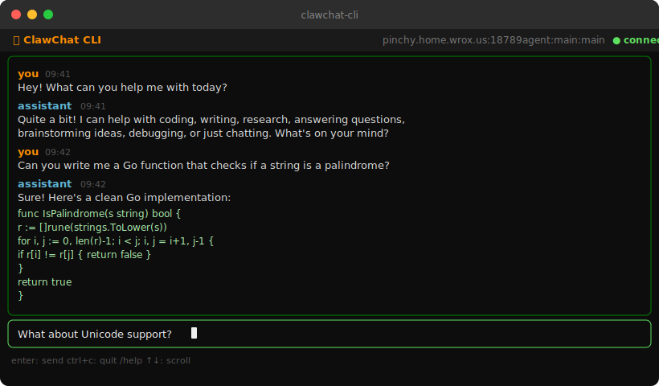

# clawchat-cli 🦀

A terminal client for [OpenClaw Gateway](https://openclaw.ai). Chat with your AI assistant without leaving the command line.

Built with [Go](https://go.dev) + [Charm](https://charm.sh) (Bubble Tea + Lip Gloss).



[](https://github.com/ngmaloney/clawchat-cli/actions/workflows/ci.yml)


---

## What it does

clawchat-cli connects to an [OpenClaw](https://openclaw.ai) gateway and gives you a full chat interface in your terminal. Messages stream in real time as the assistant responds. It uses a device identity key (ed25519) to authenticate with the gateway — the same protocol as the desktop client.

It's a sister project to [ClawChat](https://github.com/ngmaloney/clawchat), the Electron desktop app. Use clawchat-cli when you want to stay in the terminal, connect over SSH, or run on a headless server.

---

## Features

- **Streaming responses** — assistant replies appear word-by-word as they generate
- **SSH tunnel support** — connect through a bastion host without exposing your gateway
- **Message history** — loads the last 50 messages when you connect
- **Cross-client sync** — if another client sends a message, it appears after the assistant responds
- **Slash commands** — `/help`, `/clear`, `/quit`
- **Keyboard scrolling** — `↑` `↓` `PgUp` `PgDn` to scroll chat history
- **Config file** — `~/.config/clawchat-cli/config.yaml` (XDG convention, all platforms)
- **CLI flags + env vars** — override any config option at runtime

---

## Installation

### Download binary

Grab the latest release from the [releases page](https://github.com/ngmaloney/clawchat-cli/releases) and drop it somewhere on your `$PATH`.

### go install

```bash
go install github.com/ngmaloney/clawchat-cli/cmd/clawchat-cli@latest
```

### Build from source

```bash
git clone https://github.com/ngmaloney/clawchat-cli.git
cd clawchat-cli
go build -o clawchat-cli ./cmd/clawchat-cli
```

---

## Configuration

On first run, clawchat-cli will tell you where to create the config file. The default path is:

```
~/.config/clawchat-cli/config.yaml
```

### Direct connection

```yaml
gateway_url: ws://your-gateway-host:18789
token: your-gateway-token
```

### SSH tunnel

clawchat-cli can open an SSH tunnel automatically before connecting. Useful when your gateway is bound to localhost (recommended).

```yaml
gateway_url: ws://localhost:18789
token: your-gateway-token

ssh:
  host: your-gateway-host
  port: 22
  user: yourusername
  key_path: ~/.ssh/id_ed25519
  remote_port: 18789
```

### CLI flags

Any config value can be overridden at runtime:

```bash
clawchat-cli --gateway ws://other-host:18789 --token mytoken
clawchat-cli --ssh-host myserver --ssh-user me --ssh-key ~/.ssh/id_ed25519
clawchat-cli --session agent:main:main   # connect to a specific session
clawchat-cli --version
```

### Environment variables

| Variable | Description |
|----------|-------------|
| `OPENCLAW_GATEWAY_URL` | Gateway WebSocket URL |
| `OPENCLAW_TOKEN` | Auth token |
| `CLAWCHAT_SESSION` | Session key to connect to |
| `CLAWCHAT_SSH_HOST` | SSH tunnel host |
| `CLAWCHAT_CONFIG` | Override config file path |

---

## Usage

```bash
clawchat-cli
```

### Keyboard shortcuts

| Key | Action |
|-----|--------|
| `Enter` | Send message |
| `↑` / `↓` | Scroll chat |
| `PgUp` / `PgDn` | Scroll faster |
| `Ctrl+C` | Quit |

### Slash commands

| Command | Action |
|---------|--------|
| `/help` | Show available commands |
| `/clear` | Clear the chat display |
| `/quit` or `/exit` | Quit |

---

## Requirements

- Go 1.23+ (for building from source)
- An [OpenClaw](https://openclaw.ai) gateway with a valid token

---

## Related

- [ClawChat](https://github.com/ngmaloney/clawchat) — Desktop client for OpenClaw Gateway
- [clawchat.dev](https://clawchat.dev) — Project homepage
- [OpenClaw](https://openclaw.ai) — The gateway that powers it all
