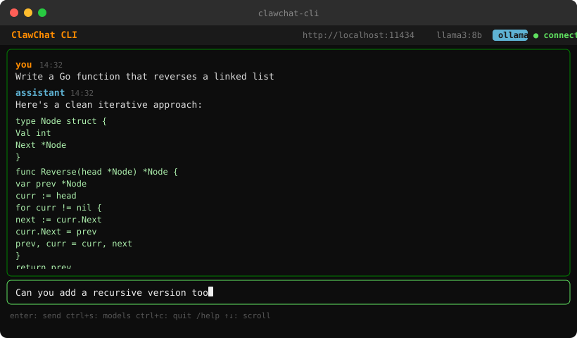

# clawchat-cli 🦀

A terminal chat client for [OpenClaw Gateway](https://openclaw.ai) and [Ollama](https://ollama.com). Chat with cloud AI or local LLMs without leaving the command line.

Built with [Go](https://go.dev) + [Charm](https://charm.sh) (Bubble Tea + Lip Gloss).



[](https://github.com/ngmaloney/clawchat-cli/actions/workflows/ci.yml)


---

## What it does

clawchat-cli supports two backends:

- **OpenClaw** — Connect to an [OpenClaw](https://openclaw.ai) gateway for full-featured AI chat (Claude, GPT, etc.)
- **Ollama** — Connect directly to an [Ollama](https://ollama.com) server for private, local LLM chat

Both backends share the same polished TUI with streaming responses, keyboard scrolling, and slash commands.

---

## Features

- **Two backends** — OpenClaw gateway or direct Ollama connection
- **Streaming responses** — assistant replies appear word-by-word as they generate
- **Model picker** — switch models on the fly with `ctrl+s` or `/model` (Ollama backend)
- **Session picker** — switch sessions with `ctrl+s` or `/sessions` (OpenClaw backend)
- **SSH tunnel support** — connect through a bastion host without exposing your gateway
- **Message history** — loads the last 50 messages when you connect (OpenClaw)
- **Multi-turn conversations** — full conversation context maintained (Ollama)
- **Cross-client sync** — if another client sends a message, it appears after the assistant responds
- **Slash commands** — `/help`, `/clear`, `/model`, `/quit`
- **Keyboard scrolling** — `↑` `↓` `PgUp` `PgDn` to scroll chat history
- **Config file** — `~/.config/clawchat-cli/config.yaml` (XDG convention, all platforms)
- **CLI flags + env vars** — override any config option at runtime

---

## Installation

### Download binary

Grab the latest release from the [releases page](https://github.com/ngmaloney/clawchat-cli/releases) and drop it somewhere on your `$PATH`.

### go install

```bash
go install github.com/ngmaloney/clawchat-cli/cmd/clawchat-cli@latest
```

### Build from source

```bash
git clone https://github.com/ngmaloney/clawchat-cli.git
cd clawchat-cli
go build -o clawchat-cli ./cmd/clawchat-cli
```

---

## Quick Start

### Ollama (local LLM)

Connect directly to a local or LAN Ollama server — nothing leaves your network:

```bash
clawchat-cli --backend ollama --ollama-url http://localhost:11434 --model llama3:8b
```

### OpenClaw (gateway)

Connect to an OpenClaw gateway:

```bash
clawchat-cli --gateway ws://your-gateway:18789 --token your-token
```

---

## Configuration

On first run, clawchat-cli will tell you where to create the config file. The default path is:

```
~/.config/clawchat-cli/config.yaml
```

### Ollama backend

```yaml
backend: ollama
ollama:
  url: http://localhost:11434
  model: llama3:8b
```

That's it. No tokens, no auth, no gateway. Just point it at your Ollama server.

### OpenClaw backend (direct connection)

```yaml
backend: openclaw   # optional, this is the default
gateway_url: ws://your-gateway-host:18789
token: your-gateway-token
```

### OpenClaw backend (SSH tunnel)

clawchat-cli can open an SSH tunnel automatically before connecting. Useful when your gateway is bound to localhost (recommended).

```yaml
gateway_url: ws://localhost:18789
token: your-gateway-token

ssh:
  host: your-gateway-host
  port: 22
  user: yourusername
  key_path: ~/.ssh/id_ed25519
  remote_port: 18789
```

### CLI flags

Any config value can be overridden at runtime:

```bash
# Ollama
clawchat-cli --backend ollama --ollama-url http://llama.local:11434 --model qwen2.5:14b

# OpenClaw
clawchat-cli --gateway ws://other-host:18789 --token mytoken
clawchat-cli --ssh-host myserver --ssh-user me --ssh-key ~/.ssh/id_ed25519
clawchat-cli --session agent:main:main   # connect to a specific session
clawchat-cli --version
```

### Environment variables

| Variable | Description |
|----------|-------------|
| `CLAWCHAT_BACKEND` | Backend: `openclaw` or `ollama` |
| `OLLAMA_HOST` | Ollama server URL |
| `OLLAMA_MODEL` | Ollama model name |
| `OPENCLAW_GATEWAY_URL` | Gateway WebSocket URL |
| `OPENCLAW_TOKEN` | Auth token |
| `CLAWCHAT_SESSION` | Session key to connect to |
| `CLAWCHAT_SSH_HOST` | SSH tunnel host |
| `CLAWCHAT_CONFIG` | Override config file path |

---

## Usage

```bash
clawchat-cli
```

### Keyboard shortcuts

| Key | Action |
|-----|--------|
| `Enter` | Send message |
| `Ctrl+S` | Model picker (Ollama) / Session picker (OpenClaw) |
| `↑` / `↓` | Scroll chat |
| `PgUp` / `PgDn` | Scroll faster |
| `Ctrl+C` | Quit |

### Slash commands

| Command | Action |
|---------|--------|
| `/help` | Show available commands |
| `/clear` | Clear the chat display (Ollama: also resets conversation) |
| `/model` | Switch model (Ollama backend) |
| `/sessions` | Switch session (OpenClaw backend) |
| `/quit` or `/exit` | Quit |

OpenClaw backend also forwards gateway commands: `/status`, `/stop`, `/thinking`, `/verbose`, `/compact`, `/reset`, `/new`.

---

## Requirements

- Go 1.23+ (for building from source)
- **Ollama backend:** An [Ollama](https://ollama.com) server with at least one model pulled
- **OpenClaw backend:** An [OpenClaw](https://openclaw.ai) gateway with a valid token

---

## Related

- [ClawChat](https://github.com/ngmaloney/clawchat) — Desktop client for OpenClaw Gateway
- [clawchat.dev](https://clawchat.dev) — Project homepage
- [OpenClaw](https://openclaw.ai) — The gateway that powers it all
- [Ollama](https://ollama.com) — Run LLMs locally
